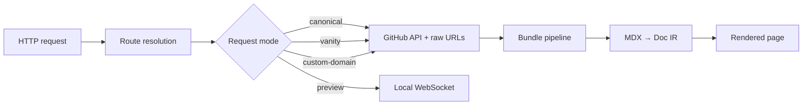

docs.page is a runtime documentation platform. Content is not pre-built — each request resolves a GitHub repository, fetches source files, and compiles MDX on demand.

## Request flow



### Route resolution

Incoming requests are parsed into an owner, repository, optional ref, and document path. The `~` segment delimiter separates the repo name from branch, PR number, or commit SHA:

```
/invertase/docs.page~main/configuration
         owner    repo   ref    path
```

Vanity subdomains (`{owner}.docs.page`) and custom domains rewrite to canonical paths with request-mode headers.

## GitHub sourcing

Documentation content, configuration, and assets load from public GitHub repositories:

- **Tree listing** — discover `docs/` pages and `.agents/skills/` files
- **Content fetch** — read `docs.json`, MDX files, and assets
- **Ref resolution** — map branch, PR, or SHA to a commit

Private repositories are rejected at bundle time with a 403.

## MDX compilation

MDX source passes through a compilation pipeline:

1. **Parse** — MDX to document intermediate representation (IR)
2. **Highlight** — syntax highlighting on fenced code blocks
3. **Sanitize** — HTML sanitization for safe rendering
4. **Components** — registered shortcode nodes (Accordion, Callout, Steps, etc.)

Variable substitution (double-brace dotted paths) runs before compilation using the `variables` object from `docs.json`.

## Caching layers

### CDN edge caching

docs.page sets `Cache-Control` and Fastly `Surrogate-Control` headers with path-specific TTLs:

| Content type | Caching behavior |
| --- | --- |
| HTML pages | Short TTL for mutable refs |
| Bundle JSON | Longer TTL for pinned commit SHAs |
| `search.json` | Dedicated TTL |
| `llms.txt` / `llms-full.txt` | Dedicated TTL |
| `sitemap.xml` / `robots.txt` | Dedicated TTL |
| Raw `.md` / `.mdx` | Dedicated TTL |

Pinned commit refs receive longer bundle JSON cache TTL than mutable branches.

### GitHub API Redis caching

GitHub API responses are cached in Redis with configurable TTLs:

- Ref resolution
- Repository metadata
- Recursive tree listings

Redis is optional; the system degrades gracefully when unavailable.

## Agent architecture

The documentation agent:

1. Receives chat messages via `POST /api/agent`
2. Searches repository MDX through a sandboxed bash tool
3. Streams LLM responses from configured providers (xAI, OpenAI, Anthropic, Google)
4. Rate-limits by client IP and repository

Provider credentials are encrypted client-side with JWE before provisioning.

## Related

- [Publishing](/publishing) — URL patterns and ref routing
- [Writing Content](/writing-content) — MDX compilation and components
- [API Reference](/api-reference) — HTTP surfaces
