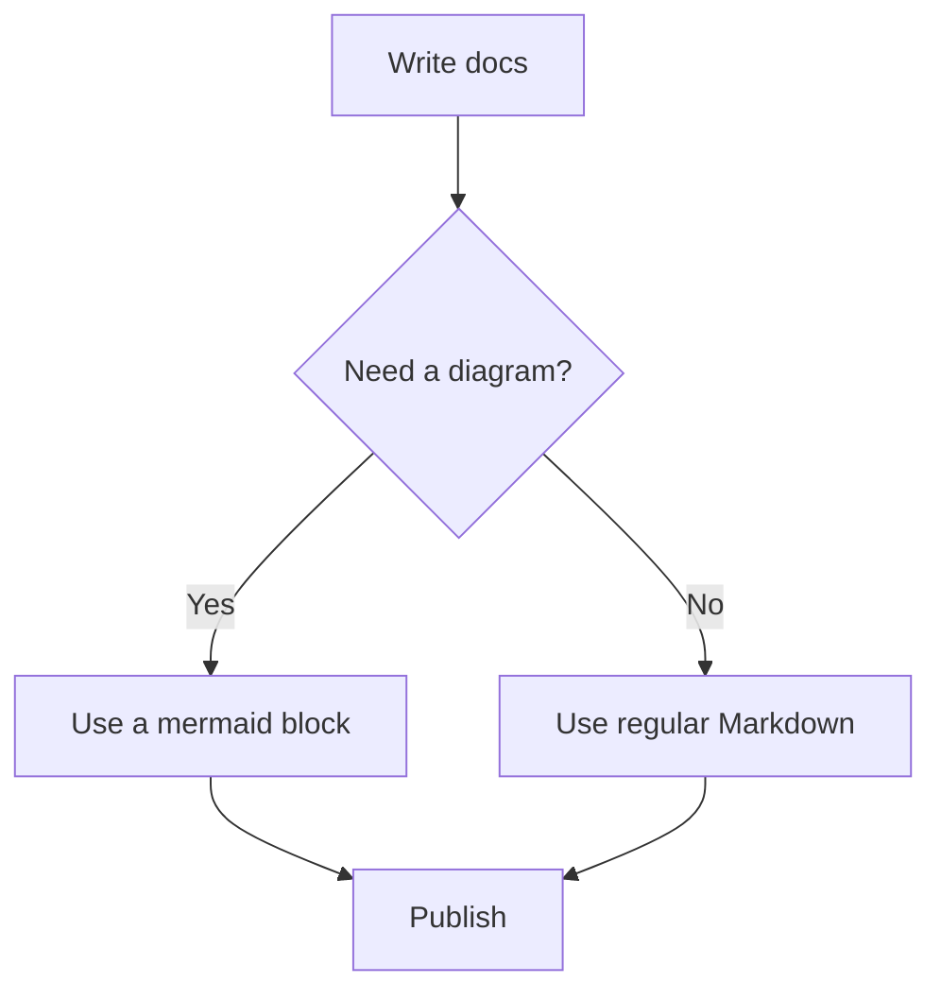
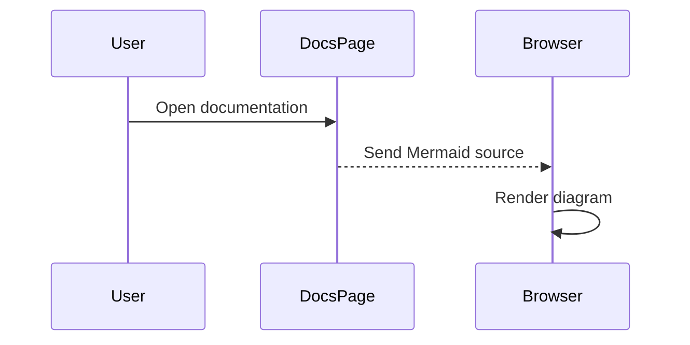

Mermaid diagrams let you describe flows, sequences, state machines, and other visuals using text. Use a standard code block with the `mermaid` language to render a diagram.

## Flowchart



````

````

## Sequence Diagram



````

````

## Notes

Mermaid diagrams render in the browser after the page loads. If the diagram syntax is invalid, docs.page will show the Mermaid error and the original source so you can fix it.
