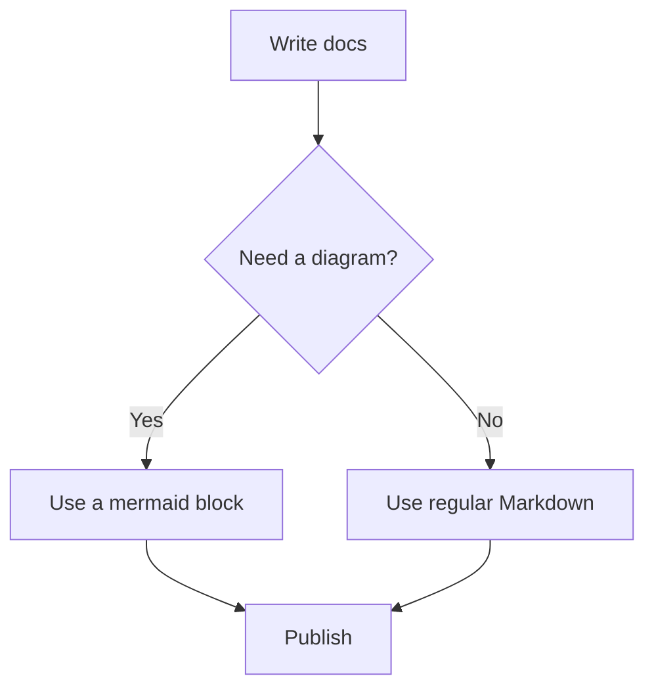
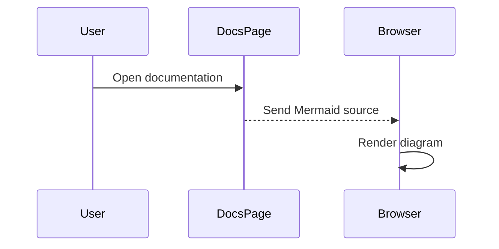

Mermaid diagrams let you describe flows, sequences, state machines, and other visuals using text. Use a standard code block with the `mermaid` language tag to render a diagram.

There is no `<Mermaid />` component; a standard Markdown fence with the `mermaid` language is all you need.

````mdx

````

## Flowchart

Describe nodes and the connections between them to render a flowchart.


````mdx

````

## Sequence diagram

List the participants and the messages between them to render a sequence diagram.



````mdx

````

## Behavior

Mermaid diagrams render in the browser after the page loads. If the diagram syntax is invalid, docs.page shows the Mermaid error along with the original source so you can fix it.

| Condition | Result |
| --- | --- |
| `mermaid` language tag | Fence content is rendered as a diagram in the browser |
| Valid diagram syntax | The diagram renders after the page loads |
| Invalid diagram syntax | Shows the Mermaid error and the original source |

## See also

- [Code blocks](/components/code-blocks): syntax-highlighted fences with copy, titles, and annotations
- [Components overview](/components): when to use tabs, code groups, and other components
